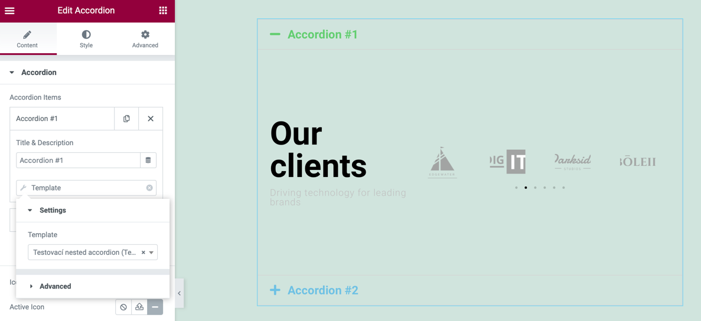
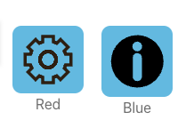
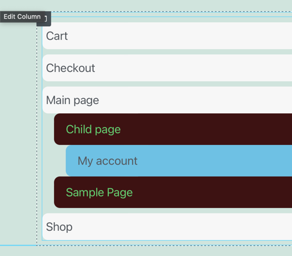
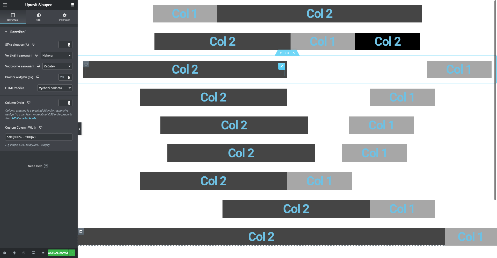

# AW3SM Elementor Extension pack (EEP)

Elementor Extension pack is an extension plugin for Elementor page builder. Adding many widgets.

## Free Features

- Adding `ACF repeater` widget
- Adding `Child Navigation` widget

## Translation Ready

nope

## Tags Widgets

**Template dynamic tag**

## Preview Widgets

**ACF dynamic tag repeater**

**ACF image repeater**

**ACF repeater**

**Child Navigation**

**Section Booster**

## Libraries

|Lib| |
|---|---|
| [Elementor](https://elementor.com) | Elementor & Elementor Pro |
| [wp-requirements-checker](https://github.com/JayJay666/wp-requirements-checker) | WP Validation library |

## Installation

> Current version is only Pre-release of Alpha or Beta!
> Keep in mind that these versions may contain an error that was not detected during testing!
> Only download the latest version, which contains bug fixes for previous versions.

## License
